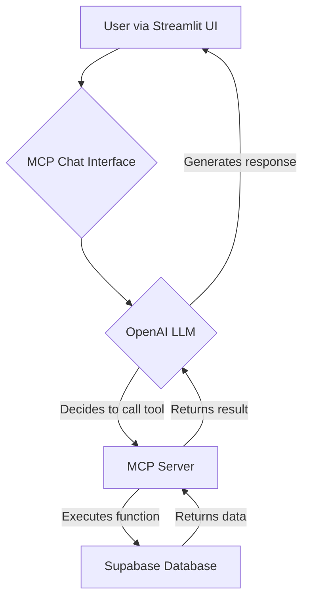

# MCP Setup & Usage Guide

## 🤖 What is MCP?

MCP (Model Context Protocol) is an advanced feature, now fully integrated into the system, that enables natural language querying of clinical trials stored in a **Supabase** backend. It provides intelligent analysis, comparison capabilities, and advanced search functionality.

## 🚀 Key Features

- **Multi-Trial Storage**: Store and query across multiple clinical trials in Supabase.
- **Natural Language Search**: Ask questions in plain English.
- **Advanced Filtering**: Search by drug, indication, phase, status, etc.
- **Trial Comparison**: Compare multiple trials side-by-side.
- **Statistical Analysis**: Generate insights across the trial database.
- **Data Export**: Export results in CSV/JSON formats.

## ✅ Current Status

The MCP functionality is now a core part of the application. The MCP server starts automatically when you run the UI, connecting to your configured Supabase database.

## 🔧 Setup

The setup process is now streamlined.

### 1. Environment Configuration
Run the setup script and provide your OpenAI API key:
```bash
python main.py setup
```

### 2. Supabase Credentials
Add your Supabase URL and Key to the `.env` file created in the previous step:
```
SUPABASE_URL="your_supabase_project_url"
SUPABASE_KEY="your_supabase_api_key"
```

### 3. Database Migration
Run the migration script to populate your Supabase database.
First, apply the schema from `corrected_supabase_setup.sql` to your Supabase project.
Then, run the migration:
```bash
python migrate_data_to_supabase.py
```

### 4. Run the Application
Start the UI. The MCP server will start automatically in the background.
```bash
python main.py ui
```

## 📋 Available MCP Tools

The MCP chat interface provides access to these tools for interacting with the Supabase database:

### **Core Storage & Analysis**
1.  **`store_trial`**: Store and analyze clinical trials.
2.  **`analyze_trial_with_model`**: Analyze with specific models.
3.  **`get_available_columns`**: List database schema.

### **Advanced Search**
4.  **`search_trials`**: Flexible search with filters.
5.  **`smart_search`**: Natural language search.
6.  **`get_trials_by_drug`**: Find trials by drug name.
7.  **`get_trials_by_indication`**: Find trials by disease.

### **Analysis & Comparison**
8.  **`get_trial_details`**: Detailed trial information.
9.  **`compare_trials`**: Side-by-side comparison.
10. **`get_trial_statistics`**: Statistical analysis.

### **Data Export**
11. **`export_trials`**: Export to CSV/JSON formats.

## 🎯 Example MCP Queries

```
"Find all diabetes trials with semaglutide"
"Show me phase 3 recruiting trials"
"What trials are there for cancer treatment?"
"Compare NCT07046273 and NCT04895709"
"Generate statistics grouped by trial phase"
"Export all phase 3 trials to CSV"
```

## 🔍 Troubleshooting

### **Connection Issues**
If the chat functionality is not working:
1.  Verify your **Supabase URL and Key** in the `.env` file are correct.
2.  Check your internet connection.
3.  Ensure your Supabase project is active and accessible.
4.  Review the console logs for any error messages related to Supabase or the MCP server.

### **Data Issues**
If queries return no data or unexpected results:
1.  Ensure the **database migration** ran successfully.
2.  Verify that your tables in Supabase (`clinical_trials`, `drug_info`, `clinical_info`) are populated with data.
3.  Use simple queries first (e.g., "list all trials") to test the connection.

## 🏗️ Technical Architecture

The architecture is centered around the Streamlit UI, the MCP Server, and the Supabase database.



### **Data Flow**
1.  **User Input**: A user types a natural language query into the chat interface.
2.  **LLM Processing**: The query is sent to an OpenAI model, which determines the user's intent and decides which MCP tool to call.
3.  **MCP Execution**: The MCP server, running in the background, receives the tool call request.
4.  **Database Query**: The MCP server executes the corresponding function, which queries the **Supabase** database.
5.  **Response**: The data is returned to the LLM, which then generates a user-friendly response.

## 🆘 Support

For any issues, please:
-   Check the main `docs/README.md`.
-   Review error messages in the UI and console.
-   Verify your OpenAI and Supabase API keys.
-   Confirm your database schema and data in Supabase.

---
**The Clinical Trial Analysis System now leverages the power of Supabase for a more robust and scalable experience.** 🚀🏥📊 