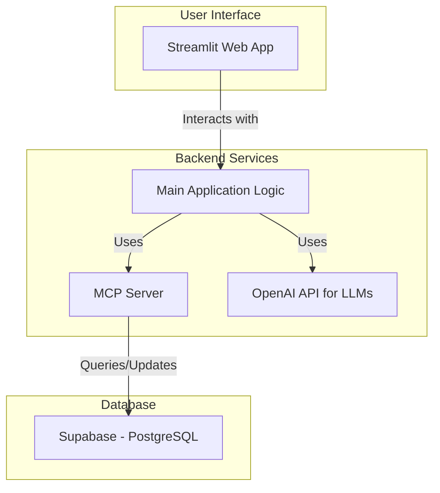

# Clinical Trial Analysis System Documentation

Welcome to the documentation for the Clinical Trial Analysis System. This guide provides a comprehensive overview of the system, its architecture, and how to get started.

## ✨ Key Features

- **AI-Driven Search**: Natural language queries to find relevant clinical trials.
- **Supabase Backend**: A scalable and robust PostgreSQL backend for data management.
- **Model Context Protocol (MCP)**: Standardized protocol for AI tool access, enabling advanced chat and reasoning capabilities.
- **Streamlit Web UI**: An intuitive interface for interacting with the system.
- **Advanced Analysis**: In-depth analysis of trial data, including status, phase, and endpoints.

## 🏛️ Architecture

The system is now powered by **Supabase**, providing a more scalable and reliable backend compared to the previous SQLite implementation.



## 📚 Documentation Index

### 🚀 Getting Started
- [**MCP Setup & Usage Guide**](MCP_SETUP_GUIDE.md) - Complete guide to setting up and using the Model Context Protocol features.
- [**README_UI**](README_UI.md) - Overview of the web UI features and usage.

### 🔧 Troubleshooting & Support
- [**Chat Assistant Troubleshooting**](CHAT_ASSISTANT_TROUBLESHOOTING.md) - Resolve issues with the chat assistant functionality.

### 🧠 Technical Documentation
- [**Enhanced LLM Query Processing**](ENHANCED_LLM_QUERY_PROCESSING.md) - How the system processes natural language queries.
- [**Reasoning Model Improvements**](REASONING_MODEL_IMPROVEMENTS.md) - Details on the reasoning model enhancements.
- [**Tabular Comparison Update**](TABULAR_COMPARISON_UPDATE.md) - Information about the tabular comparison feature.

### 📋 Reference
- [**GenAI Case Clinical Trial Analysis Prompt**](GenAI_Case_Clinical_Trial_Analysis_PROMPT_ver1.00.docx.md) - Detailed prompt for clinical trial analysis.

## 🚀 Quick Start Guide

To get the system up and running, follow these steps:

### 1. Environment Setup

The system now uses a `.env` file to manage environment variables for both OpenAI and Supabase.

**Run the setup script:**
```bash
python main.py setup
```
This will prompt you for your **OpenAI API Key**.

### 2. Supabase Configuration

After running the setup, you need to add your Supabase credentials to the generated `.env` file.

Open the `.env` file and add the following lines:
```
SUPABASE_URL="your_supabase_project_url"
SUPABASE_KEY="your_supabase_api_key"
```
Replace `"your_supabase_project_url"` and `"your_supabase_api_key"` with your actual Supabase credentials.

### 3. Database Migration (One-Time Setup)

To populate your Supabase database with the clinical trial data from the local SQLite file (`clinical_trials.db`), run the migration script:

First, ensure you have the necessary SQL setup file. If not, you can generate it:
```bash
python simple_supabase_test.py
```
This creates `corrected_supabase_setup.sql`. Apply this schema to your Supabase project via the Supabase SQL Editor.

Then, run the migration:
```bash
python migrate_data_to_supabase.py
```

### 4. Running the Application

Once the setup and migration are complete, you can start the web interface:

```bash
python main.py ui
```

The application will automatically detect the Supabase credentials in your `.env` file and connect to your Supabase database. The MCP server is now started automatically in the background.

## 🆘 Getting Help

If you encounter issues:

1.  Check the relevant troubleshooting guide.
2.  Review error messages in the console.
3.  Verify your **OpenAI API key** and **Supabase credentials** are correctly set in the `.env` file.
4.  Ensure the database migration completed successfully and your Supabase tables are populated. 